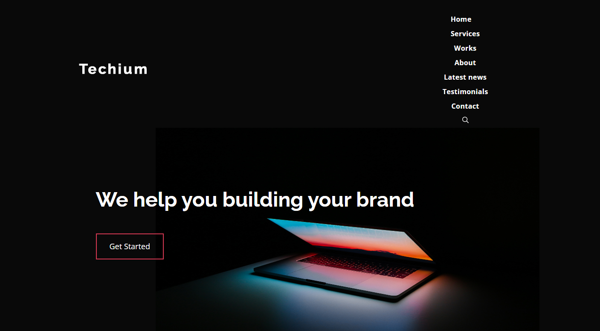
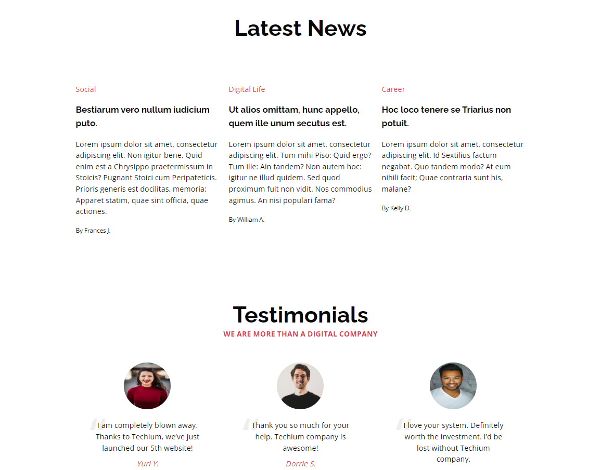

<picture>
 <source media="(prefers-color-scheme: dark)" srcset="https://images.squarespace-cdn.com/content/v1/5a4bfe8bf09ca4228ceca3b7/1539139199598-ANH454IHZI1OKWONKRXY/logo.jpg?format=2500w">
 <source media="(prefers-color-scheme: light)" srcset="https://encrypted-tbn0.gstatic.com/images?q=tbn:ANd9GcQIrK23KvJPB7XdZrIk9mHwe3GZvtsUZLjkh-eG6KRgCLeWu3MW0kFcggq4COpLmeZviQ&usqp=CAU">
 
</picture>

<B><h1 align="center">
HolbertonSchool Web Front End
</h1></B>

The front-end web development is a vital component of creating interactive and visually appealing websites. It focuses on everything that users see and interact with directly in their web browser. HTML (HyperText Markup Language) and CSS (Cascading Style Sheets) are the foundational technologies of front-end development. HTML provides the structure of the webpage by defining elements like headings, paragraphs, links, and images. CSS enhances this structure by controlling the presentation and layout, allowing developers to style elements with colors, fonts, and positioning. Together, HTML and CSS enable the creation of responsive and user-friendly interfaces that are essential for delivering a positive user experience. Mastery of these technologies is crucial for any front-end developer aiming to build modern, accessible, and engaging websites.

examples of Web Front End projects

## **Topics Covered**
- CSS_advanced
- developer_tools
- flexbox
- forms
- html_advanced
- responsive_design
- sass_scss

## **Authors** :black_nib:

Laroche Marion [Github](https://github.com/Mamuche), [LinkedIn](https://www.linkedin.com/in/marion-laroche-8b235a284/).